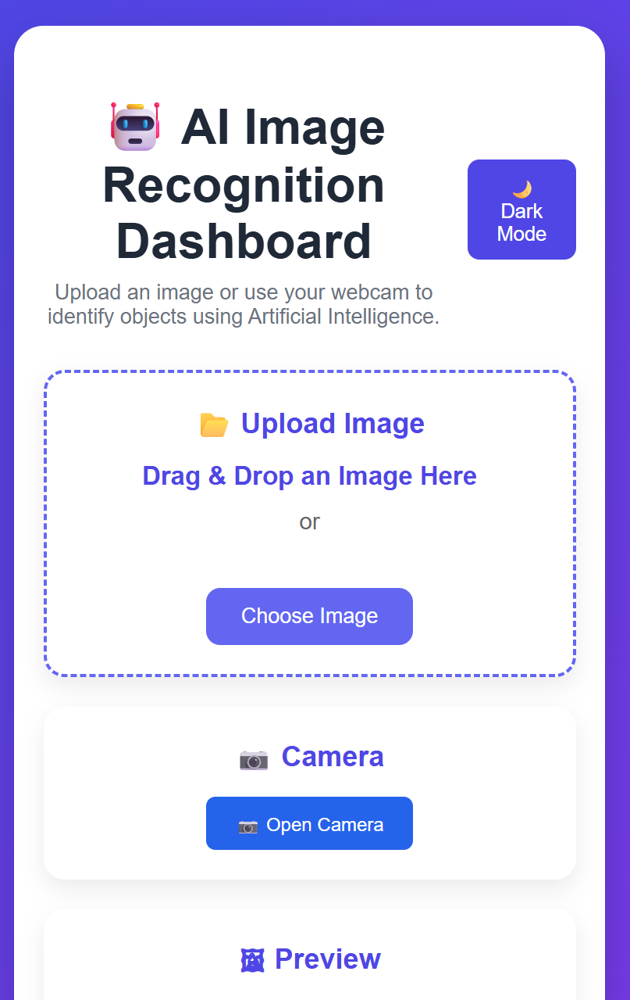
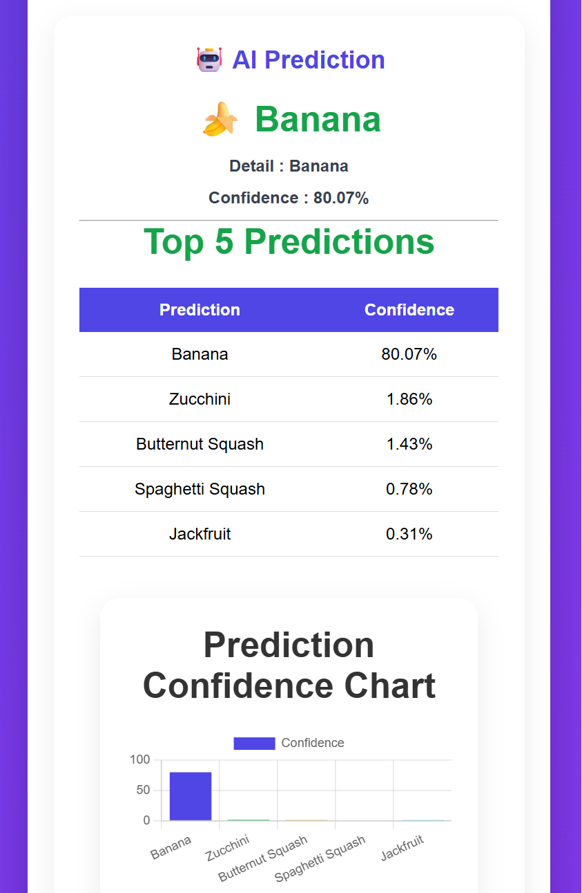
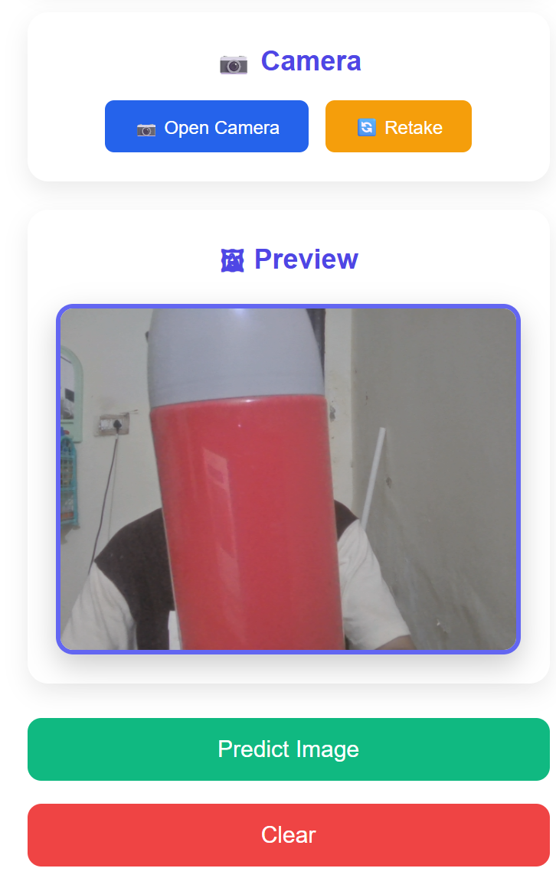
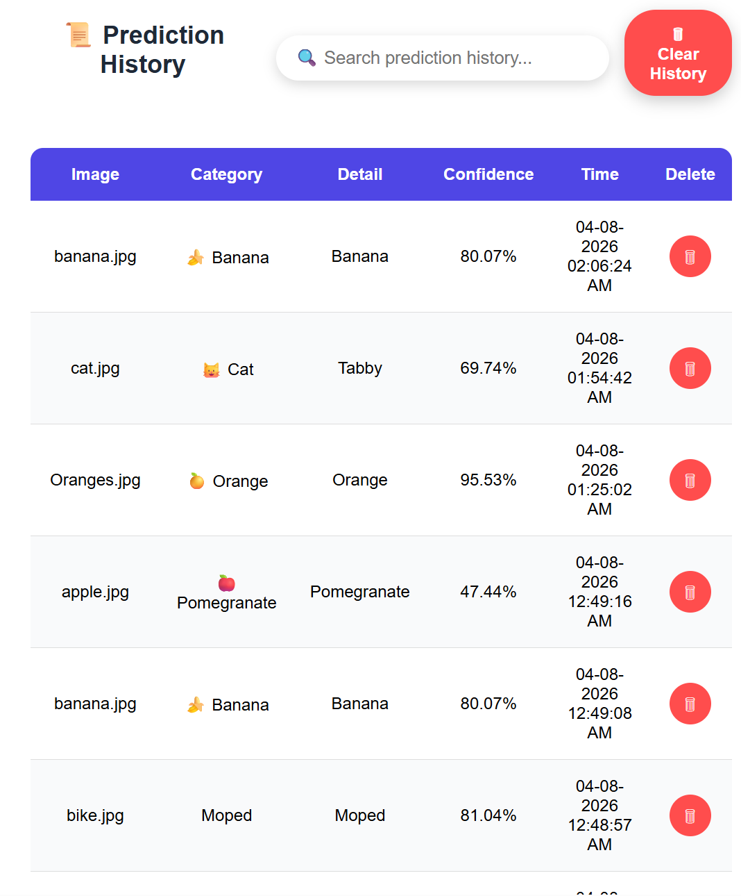

# 🤖 AI Image Recognition Dashboard

<p align="center">



</p>

<p align="center">

An AI-powered Image Recognition Dashboard built using **Python, Flask, TensorFlow MobileNetV2, HTML, CSS, JavaScript, Chart.js, and ReportLab**.

The application allows users to upload images or capture photos using a webcam, classify them using Artificial Intelligence, visualize prediction confidence, generate PDF reports, and manage prediction history.

</p>

---

# 🚀 Features

## 🧠 Artificial Intelligence

- ✅ Image Recognition using TensorFlow MobileNetV2
- ✅ Top 5 AI Predictions
- ✅ Confidence Percentage
- ✅ Detailed Prediction Information

---

## 📂 Image Upload

- ✅ Drag & Drop Upload
- ✅ Browse Image
- ✅ Live Image Preview
- ✅ JPG / JPEG / PNG Support

---

## 📷 Webcam

- ✅ Open Camera
- ✅ Live Camera Capture
- ✅ Retake Camera Photo
- ✅ Auto Close Camera

---

## 📊 Visualization

- ✅ Confidence Bar Chart
- ✅ Top 5 Prediction Table
- ✅ Prediction Details

---

## 📑 Reports

- ✅ Download Prediction Report (PDF)
- ✅ Prediction Details Included
- ✅ Webcam Images Supported

---

## 📜 Prediction History

- ✅ Automatic History Saving
- ✅ Search Prediction History
- ✅ Delete Individual Prediction
- ✅ Clear Complete History
- ✅ CSV-based Storage

---

## 🎨 User Interface

- ✅ Professional Dashboard
- ✅ Responsive Design
- ✅ Dark Mode
- ✅ Light Mode
- ✅ Clean UI

---

# 🛠 Tech Stack

### Backend

- Python
- Flask

### Artificial Intelligence

- TensorFlow
- MobileNetV2
- NumPy

### Frontend

- HTML5
- CSS3
- JavaScript

### Data Visualization

- Chart.js

### PDF Generation

- ReportLab

### File Handling

- CSV
- Werkzeug

---

# 📸 Project Preview

## 🏠 Home Page


---

## 🤖 AI Prediction



---

## 📷 Webcam



---

## 🌙 Dark Mode


---

## 📜 Prediction History



---

## 📄 PDF Report


---

# 📂 Project Structure

```text
AI-Image-Recognition-Dashboard/

│── app.py
│── model.py
│── requirements.txt
│── README.md
│── LICENSE
│── .gitignore

├── static/
│   ├── style.css
│   ├── script.js

├── templates/
│   └── index.html

├── uploads/
│   └── (Uploaded Images)

├── reports/
│   └── (Generated PDF Reports)

├── history/
│   └── history.csv

├── screenshots/
│   ├── home.png
│   ├── prediction.png
│   ├── camera.png
│   ├── history.png
│   ├── dark-mode.png
│   └── pdf-report.png

└── saved_model/
```

---

# ⚙️ Installation Guide

## 1️⃣ Clone the Repository

```bash
git clone https://github.com/Anshulkumar8787/AI-Image-Recognition-Dashboard.git
```

Move into the project directory:

```bash
cd AI-Image-Recognition-Dashboard
```

---

## 2️⃣ Create a Virtual Environment (Recommended)

### Windows

```bash
python -m venv venv
venv\Scripts\activate
```

### Linux / macOS

```bash
python3 -m venv venv
source venv/bin/activate
```

---

## 3️⃣ Install Dependencies

```bash
pip install -r requirements.txt
```

---

## 4️⃣ Run the Flask Application

```bash
python app.py
```

---

## 5️⃣ Open in Browser

```
http://127.0.0.1:5000
```

---

# ▶️ How to Use

### Option 1 — Upload an Image

1. Click **Choose Image**
2. Select a JPG, JPEG, or PNG image
3. Click **Predict Image**
4. View AI prediction
5. Download the PDF report (optional)

---

### Option 2 — Use Webcam

1. Click **Open Camera**
2. Capture a photo
3. Retake if required
4. Click **Predict Image**
5. View AI results

---

# 🔄 Application Workflow

```text
User Uploads Image
        │
        ▼
Image Preprocessing
        │
        ▼
TensorFlow MobileNetV2
        │
        ▼
Top 5 Predictions
        │
        ▼
Confidence Chart
        │
        ▼
Prediction History
        │
        ▼
PDF Report Generation
```

---

# 📊 Key Functionalities

| Feature | Status |
|----------|--------|
| AI Image Recognition | ✅ |
| Drag & Drop Upload | ✅ |
| Webcam Capture | ✅ |
| Live Preview | ✅ |
| Top 5 Predictions | ✅ |
| Confidence Chart | ✅ |
| Prediction History | ✅ |
| Search History | ✅ |
| Delete Individual Prediction | ✅ |
| Clear History | ✅ |
| PDF Report | ✅ |
| Dark / Light Mode | ✅ |
| Responsive Dashboard | ✅ |

---

# 🌐 Deployment

This project can be deployed on multiple cloud platforms.

### Supported Platforms

- ✅ Render
- ✅ Railway
- ✅ PythonAnywhere
- ✅ Heroku (with required configuration)
- ✅ VPS / Local Server

---

# 📦 Python Requirements

The project uses the following major Python libraries:

- Flask
- TensorFlow
- NumPy
- Pillow
- Werkzeug
- ReportLab
- Matplotlib

Install all dependencies using:

```bash
pip install -r requirements.txt
```

---

# ⚡ Performance

## AI Model

- Model: MobileNetV2
- Dataset: ImageNet (Pre-trained)
- Classes: 1000+
- Framework: TensorFlow / Keras

---

## Application Performance

| Feature | Performance |
|----------|------------|
| Image Upload | ⚡ Fast |
| Webcam Capture | ⚡ Real-time |
| AI Prediction | ⚡ Usually under 1 second* |
| PDF Generation | ⚡ Fast |
| History Saving | ⚡ Instant |
| Search History | ⚡ Instant |
| Dark Mode | ⚡ Instant |

> *Prediction speed depends on your computer hardware and whether TensorFlow is using CPU or GPU.

---

# 📈 Application Workflow

```text
                User

                  │

      Upload Image / Webcam

                  │

                  ▼

         Image Preprocessing

                  │

                  ▼

      TensorFlow MobileNetV2

                  │

                  ▼

      Top 5 AI Predictions

                  │

        ┌─────────┼──────────┐

        ▼         ▼          ▼

 Confidence   History     PDF Report

    Chart      CSV

```

---

# 🔒 Supported Image Formats

- JPG
- JPEG
- PNG

---

# 📊 Generated Reports

The application automatically generates:

- Prediction Report (PDF)
- Prediction History (CSV)

---

# 🎯 Use Cases

This project can be used for:

- Educational Demonstrations
- AI & Machine Learning Learning Projects
- Computer Vision Practice
- TensorFlow Image Classification Examples
- Flask Web Application Development
- Portfolio Projects
- Final Year / College Projects
- Resume Showcase
- Interview Demonstrations

---

# 🔮 Future Enhancements

Some ideas for future versions:

- 🔐 User Login & Authentication
- ☁️ Cloud Image Storage
- 📱 Mobile Responsive Enhancements
- 🌍 Multi-language Support
- 🧠 Custom Model Training
- 🎥 Video File Recognition
- 🖼️ Batch Image Prediction
- 🔗 REST API Support
- 📊 Prediction Analytics Dashboard
- 🤖 Multiple AI Models

---

# 🤝 Contributing

Contributions are always welcome.

If you would like to improve this project:

1. Fork this repository
2. Create your feature branch

```bash
git checkout -b feature/YourFeature
```

3. Commit your changes

```bash
git commit -m "Added New Feature"
```

4. Push to your branch

```bash
git push origin feature/YourFeature
```

5. Open a Pull Request

---

# 📝 License

This project is licensed under the **MIT License**.

See the `LICENSE` file for more details.

---

# 👨‍💻 Author

## Anshul Kumar

**Btech Data Science Student | AI & Machine Learning Enthusiast | Python Developer**

### Skills

- Python
- Flask
- TensorFlow
- HTML
- CSS
- JavaScript
- Machine Learning
- Artificial Intelligence

---

# 📬 Contact

GitHub:

https://github.com/Anshulkumar8787

Email:

your-anshulkumar2003@gmail.com

---

# ⭐ If You Like This Project

If this repository helped you or you found it useful:

⭐ Star this repository

🍴 Fork this repository

🛠️ Share improvements through Pull Requests

---

# 🙏 Acknowledgements

Special thanks to the open-source community and the developers of:

- TensorFlow
- Flask
- Chart.js
- ReportLab
- NumPy
- Pillow

Their tools made this project possible.

---

# 📌 Project Highlights

- AI-Powered Image Recognition
- MobileNetV2 Deep Learning Model
- Flask Web Application
- Webcam Integration
- Drag & Drop Upload
- Live Image Preview
- Top 5 Predictions
- Confidence Visualization
- Prediction History
- Search & Delete History
- Automatic CSV Storage
- PDF Report Generation
- Dark / Light Theme
- Responsive Dashboard

---

# 🚀 Future Scope

Potential future enhancements include:

- User Authentication
- Cloud Storage Integration
- Batch Image Prediction
- Video Recognition
- Custom AI Model Upload
- REST API
- Docker Support
- Multi-language Interface

---

<p align="center">

Made with ❤️ using Python, Flask & TensorFlow

</p>

<p align="center">

© 2026 Anshul Kumar. All Rights Reserved.

</p>